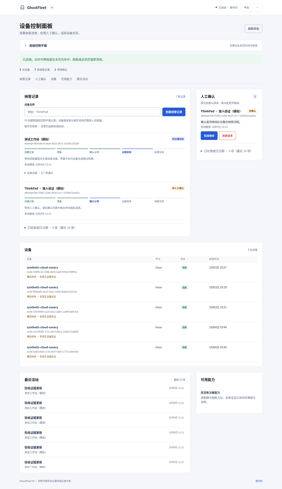

# Console usage / 控制台使用

## 中文

<!-- topic:session -->
### 连接与凭据

按 [快速开始](GETTING_STARTED.md) 启动并打开同源控制台，在设置中使用本控制面的只读或操作员访问令牌连接。该令牌不同于 Cloudflare API 或设备/提供方凭据。令牌仅保留在页面内存中，连接后清空输入框，断开、刷新或关闭页面时清除。语言、主题和侧栏偏好可保存在浏览器中；凭据不得写入 localStorage、URL、剪贴板日志或截图。

界面默认中文，支持英文以及浅色、深色和跟随系统的主题。只读会话不能变更对象；操作员可管理生命周期和 HumanGate，但默认不执行设备能力。`ACTIVE` 是准入状态，不代表在线或心跳正常；填写设备名称不会安装代理或生成真机证据。控制面准入不证明独立调用方已完成目录发现、认证、路由、权限或回滚切换。

<!-- topic:workflow -->
### 列表、详情和不确定状态

首页显示最近设备、进行中的尝试、待确认事项和活动；侧栏可进入设备、纳管、人类批准、能力、事件和设置页面。列表支持名称/ID 搜索、状态筛选、排序、分页和可选列；点击记录打开详情抽屉并保留查询条件。Ctrl/Cmd K 搜索页面或记录，方向键和 Enter 选择，Esc 关闭。移动端使用导航抽屉，宽表格在自身区域横向滚动。

操作员创建纳管尝试、准备并请求精确批准，核对对象、请求和期限后再批准或拒绝。最新证据中的 `FAIL/UNKNOWN` 覆盖旧 `PASS`。错误在当前对话框内显示，可读取服务端状态；变更结果不确定时暂时禁用按钮，不自动重试。结构化 `asset_hint` 不直接转成对象标签，优先使用有效字符串、已绑定节点或稳定的尝试 ID。

能力目录仅显示定义与风险，不执行命令。标明合成来源的证据不能作为真实设备验收。

<!-- topic:preview -->
### 设计、合成图片与验证

界面使用 Tabler CSS 和原生 JavaScript，参考公开布局，不额外依赖 React 或图表库。设计变量见 [DESIGN](../DESIGN.md)，产品边界见 [PRODUCT](../PRODUCT.md)，许可见 [第三方说明](../THIRD_PARTY_NOTICES.md)。认证、权限范围、有效期、批准/状态与准入由服务端决定，界面标签不授予权限。

七张图片均来自隔离的合成预览，不证明生产 Pages 或真实设备试验已完成：

[devices](images/console-devices.png) · [detail](images/console-detail.png) · [mobile](images/console-mobile.png) · [mobile devices](images/console-mobile-devices.png) · [English](images/console-english.png) · [dark](images/console-dark.png)

已有布局、键盘、筛选、令牌内存、只读和偏好持久化检查，不替代完整无障碍认证或平台真机验收。每次图像变更须按公开边界策略重新审阅精确 SHA。

## English

<!-- topic:session -->
### Connection and credentials

Start with [Getting started](GETTING_STARTED.md) and open the same-origin Console. Under Settings, connect with this control plane's read/operator bearer, never a Cloudflare API or device/provider credential. Tokens stay in page memory, the input clears after connection, and disconnect/reload/close clears them. Language/theme/sidebar preferences may persist locally; credentials must not enter localStorage, URLs, clipboard logs or screenshots.

The Console defaults to Chinese with English and light/dark/system support. Read-only sessions cannot mutate objects. Operators manage lifecycle/HumanGate objects but do not execute hardware capabilities by default. ACTIVE is admission status, not connectivity/heartbeat; entering a device name installs no agent and creates no hardware proof. Control-plane admission does not establish independent consumer discovery/authentication/route/permission/rollback cutover.

<!-- topic:workflow -->
### Lists, details and uncertain outcomes

The homepage shows recent devices, active attempts, pending approvals and activity. Navigate to devices/enrollment/gates/capabilities/events/settings through the sidebar. Lists support name/ID search, state filters, sort, pagination and optional columns. Detail drawers preserve query context. Ctrl/Cmd K searches pages/records; arrows/Enter select and Esc closes. Mobile uses navigation drawers and wide tables scroll within their own region.

Operators create an attempt, prepare and request an exact gate, then verify object/request/expiry before approving or rejecting. Latest FAIL/UNKNOWN evidence supersedes old PASS. Dialogs show errors and permit a server-state read; uncertain mutations disable buttons without automatic retry. Structured asset_hint is not coerced into an object label; use a valid string or the bound node/stable attempt ID.

The capability directory displays definitions/risks without execution. Source-labeled synthetic evidence is not real device acceptance.

<!-- topic:preview -->
### Design, synthetic images and validation

The UI uses Tabler CSS/native JavaScript with public layout references and no additional React/chart dependency. See [DESIGN](../DESIGN.md) for tokens, [PRODUCT](../PRODUCT.md) for boundaries and [third-party notices](../THIRD_PARTY_NOTICES.md) for licensing. Server authority determines authentication, scope, TTL, gates/state and admission; UI labels grant no authority.

All seven images are isolated synthetic previews, not production Pages or a real canary:

[Devices](images/console-devices.png) · [Detail](images/console-detail.png) · [Mobile](images/console-mobile.png) · [Mobile devices](images/console-mobile-devices.png) · [English](images/console-english.png) · [Dark](images/console-dark.png)

Existing layout/keyboard/filter/token-memory/read-only/persistence checks do not establish complete accessibility certification or platform hardware acceptance. Every changed image requires renewed exact-SHA publication-policy review.
